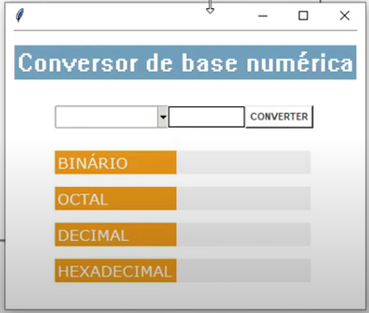
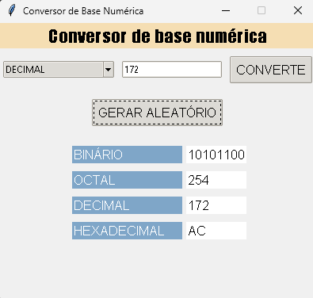

# Calculadora de Bases #
Este é o repositório de um projeto autoral no qual o objetivo é realizar a conversão de bases entre numeros de maneira mais simples e fácil, 
feito por Caio Gomes. 

  

- **Modo de usar**: Selecione primeiramente a base do número, no espaço em branco escreva o número que está na base selecionada, então clique em converter! Após isso, o valor do mesmo número em outras bases irá aparecer. Implementei também a função de número aleatório caso o usuário deseje apenas testar o programa.

  

